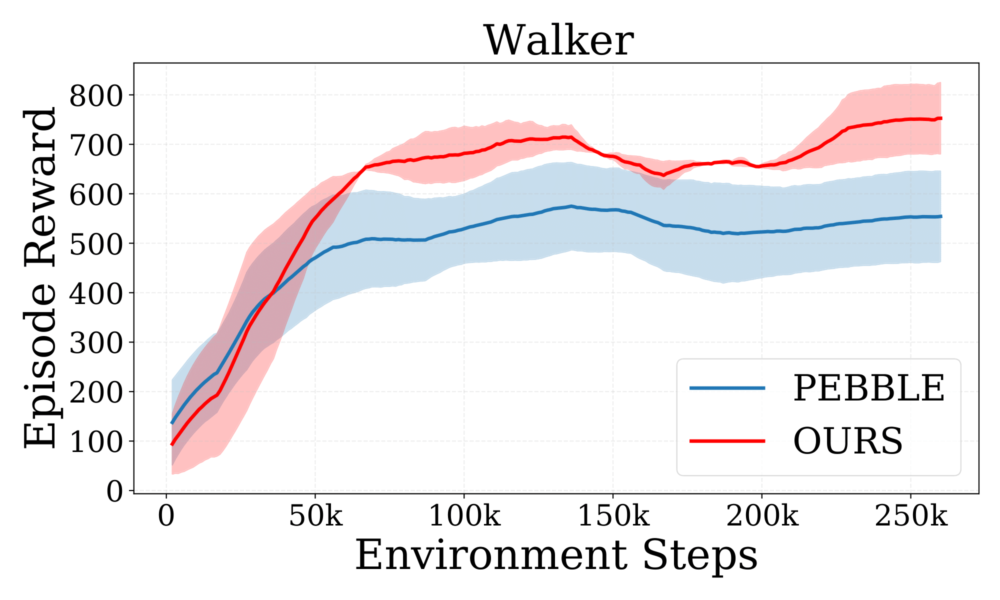
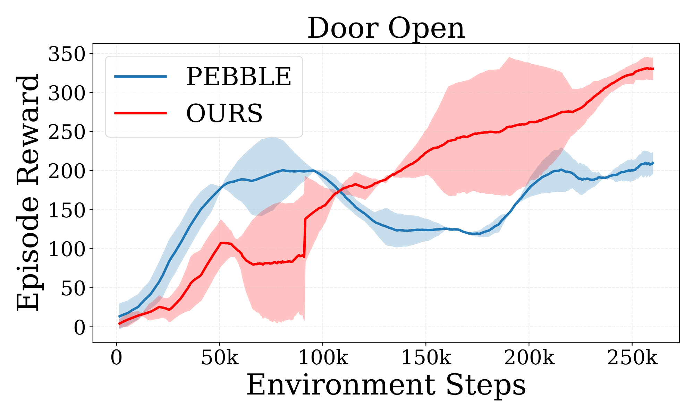

[NeurIPS 2025] Official codebase for "On The Sample Complexity Bounds In Bilevel Reinforcement Learning".

## How to install

### Install MuJoCo 2.0

```bash
sudo apt update
sudo apt install unzip gcc libosmesa6-dev libgl1-mesa-glx libglfw3 patchelf libegl1 libopengl0
sudo ln -s /usr/lib/x86_64-linux-gnu/libGL.so.1 /usr/lib/x86_64-linux-gnu/libGL.so
wget https://www.roboti.us/download/mujoco200_linux.zip -P /tmp
unzip /tmp/mujoco200_linux.zip -d ~/.mujoco
wget https://www.roboti.us/file/mjkey.txt -P /tmp
mv /tmp/mjkey.txt ~/.mujoco/
```

### Install dependencies

```bash
conda env create -f conda_env.yml
conda activate mrn
pip install -e .[docs,tests,extra]
cd custom_dmcontrol
pip install -e .
cd ../custom_dmc2gym
pip install -e .
cd ..
pip install git+https://github.com/rlworkgroup/metaworld.git@04be337a12305e393c0caf0cbf5ec7755c7c8feb
pip install pybullet termcolor
```


## How to run

### DeepMind Control Suite (Walker)

#### Ours

```bash
python train_V.py env=walker_walk seed=12345 agent.params.actor_lr=0.0005 agent.params.critic_lr=0.0005 num_unsup_steps=9000 num_train_steps=1000000 num_interact=20000 max_feedback=100 reward_batch=10 reward_update=50 feed_type=1
```

#### PEBBLE

```bash
python train_PEBBLE.py env=walker_walk seed=12345 agent.params.actor_lr=0.0005 agent.params.critic_lr=0.0005 num_unsup_steps=9000 num_train_steps=1000000 num_interact=20000 max_feedback=100 reward_batch=10 reward_update=50 feed_type=1
```

### Meta-world (Door Open)

#### Ours

```bash
python train_V.py env=metaworld_door-open-v2 seed=12349 agent.params.actor_lr=0.0003 agent.params.critic_lr=0.0003 num_unsup_steps=9000 num_train_steps=1000000 agent.params.batch_size=512 double_q_critic.params.hidden_dim=256 double_q_critic.params.hidden_depth=3 diag_gaussian_actor.params.hidden_dim=256 diag_gaussian_actor.params.hidden_depth=3 num_interact=5000 max_feedback=1000 reward_batch=10 reward_update=10 feed_type=1
```

#### PEBBLE

```bash
python train_PEBBLE.py env=metaworld_door-open-v2 seed=12345 agent.params.actor_lr=0.0003 agent.params.critic_lr=0.0003 num_unsup_steps=9000 num_train_steps=1000000 agent.params.batch_size=512 double_q_critic.params.hidden_dim=256 double_q_critic.params.hidden_depth=3 diag_gaussian_actor.params.hidden_dim=256 diag_gaussian_actor.params.hidden_depth=3 num_interact=5000 max_feedback=1000 reward_batch=10 reward_update=10 feed_type=1
```

### 4). Results: Success rate performance
Here we provide the success rate performance results for various environments:

  #### DeepMind Control Suite (Walker)

  <p align="center">
    
  </p>

  #### Meta-world (Door Open)

  <p align="center">
    
  </p>